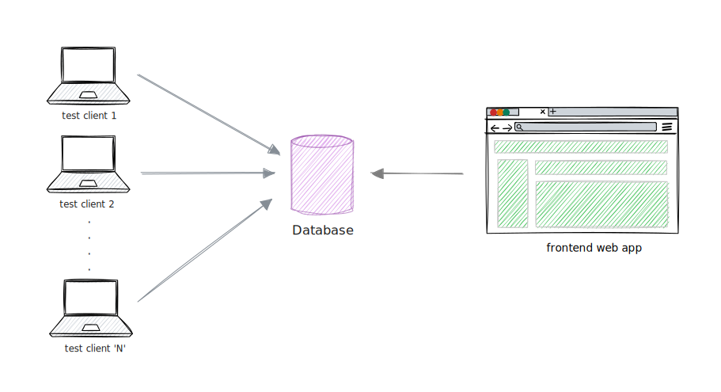

+++
title = "KLA Corp 2025"
description = "The Interview at KLA Corp."
template = "fly.html"
+++

This write up contains the things that were happened during the KLA Men's Drive 2025 for the SQE Intern role on 12 Feb 2025.

## ROUND 1

There were two coding problems.

1. URL validation. [`code`](https://rentry.co/validate-url)  
**Format:** `protocol://domain:port/path?security#fragment`  

> **NOTE:** port range is from 1 - 65535

2. Minimum window containing the target string. [`gfg`](https://www.geeksforgeeks.org/find-the-smallest-window-in-a-string-containing-all-characters-of-another-string/) [`leetcode`](https://leetcode.com/problems/minimum-window-substring/description/)

## ROUND 2

Validate the logs, which will be in the format below.

**Format:** `Date | IP | Status Code | Endpoint`  
**Eg:** `2025-02-13 12:45:12 | 192.168.158.125 | 200 | /profile`

There may also be malformed entries in the log file.

How would you validate these entries and how will you store it ?

### Follow up questions:

1. Get all the valid logs entries.
2. In the log entires there is an additional field with time in seconds. So now get all the endpoints with their total time.  
```
2025-02-13 12:45:12 | 192.168.158.125 | 200 | /profile | 134
```

3. Get all the unique endpoints
4. Find the time frame in a day having maximum number of requests
> **NOTE:** time frame is like 1.00 - 2.00, 2.00 - 3.00, 12.00 - 13.00, etc.,

## ROUND 3

Redesigning the Architecture.



In this architecture, There are 'N' clients running some automated tests and sending step-by-step tests results to the database. And there is a web app that fetches results from the database to display it on the frontend.

With the current architecture, `lock` may occur while all the test clients and the frontend are trying to read/write to the database. How would you solve this problem ?

## ROUND 4

- Discussions on the projects which I have worked on.
- What is KLA ?
- Why KLA ?
- How much you are interested to join KLA ?
- What did your seniors say about KLA ?
- General discussions on KLA and SQE Intern role.
